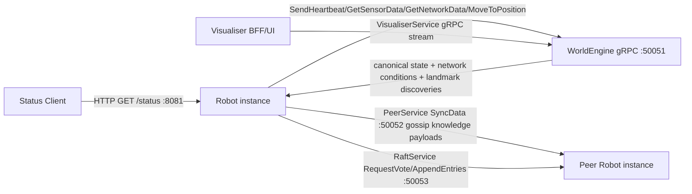

# Codebase Architecture Map

This document provides the high-level structure, module responsibilities, dependency flow, and runtime interaction model for SwarmProject.

## High-Level Directory Tree

```text
SwarmProject/
    Communications/      # protobuf contracts + generated Go stubs
    Robot/               # robot runtime, gossip engine, raft engine, P2P/Raft servers, tests
    WorldEngine/         # simulation authority, landmark truth, and network oracle
    Visualiser/          # Go BFF + React/PixiJS UI
    docs/                # architecture map, specification, ADRs
```

## Core Modules & Responsibilities

| Module | Primary Responsibility |
| :--- | :--- |
| **Communications** | API contracts. Defines gRPC services (`RobotService`, `VisualiserService`, `PeerService`, `RaftService`). |
| **Robot** | Agent-level decision-making: WorldEngine-authoritative movement, landmark discovery, gossip knowledge dissemination via `PeerService`, Raft consensus via `RaftService`, and `/status` observability endpoint. |
| **WorldEngine** | Simulation arbitration. Owns all robot positions, advances robots toward their targets every 30 ms, validates wall collisions, owns landmark placement and discovery, and calculates communication decay metrics based on Euclidean distance. |
| **Visualiser** | Observation. Subscribes to environment and robot data from the World Engine without interfering in simulation physics. |

## Go Package Dependency Map

```mermaid
graph TD
    "robot" --> "communications/proto"
    "worldengine" --> "communications/proto"
    "visualiser/server" --> "communications/proto"
```

## Runtime Interaction Map



## Communication Subsystems

### PeerService — Gossip Knowledge Dissemination
`PeerService.SyncData` (port `:50052`) is the gossip transport channel. It carries:
- Landmark discovery entries serialised as `GossipMessage` in `PeerSyncRequest.payload`
- Lamport clock updates for gossip metadata (not correctness-critical)
- Future shared robot knowledge in the same extensible payload format

Deduplication is by landmark `ID + timestamp`. The `GossipEngine` runs a background 1-second ticker to select an active neighbour from `NeighbourRegistry` and push known landmark entries via `sendGossipMessage`. The periodic constrained sync (every 2 s, network-delay-simulated) also maintains neighbour liveness.

### RaftService — Consensus
`RaftService` (port `:50053`) is strictly separate from `PeerService`. It carries:
- `RequestVote` — candidate vote solicitation
- `AppendEntries` — heartbeat and replicated log entries

Raft traffic is routed through the same WorldEngine-derived network topology (bandwidth, latency, reliability) as gossip traffic but via a separate gRPC service and port, preventing any intermeshing at the RPC contract level.

## Timing Frequencies

| Component | Loop / Timer | Interval | Notes |
| :--- | :--- | :--- | :--- |
| **Robot** | Heartbeat ticker | **30 ms (~33 Hz)** | Each tick: `SendHeartbeat` (reads canonical X/Y/Heading) → `GetSensorData` (obstacle + landmark detection). |
| **Robot** | Movement ticker | **Every 2 s** | `MoveToPosition` with absolute target `(X, Y)` + `desired_heading`. |
| **Robot** | Gossip peer sync | **Every 2 s** | `GetNetworkData` → goroutine per peer dispatching constrained Lamport clock sync + neighbour registration; `GossipEngine` ticker sends landmark payloads independently. |
| **Robot** | GossipEngine ticker | **Every 1 s** | Selects active neighbour, pushes all known `LandmarkEntry` records as a `GossipMessage`. |
| **Robot** | Raft sync tick | **Every 250 ms** | `GetNetworkData` → goroutine per peer dispatching constrained `RequestVote` or `AppendEntries` over `RaftService`. |
| **Robot** | Raft leader ping append | **Every 10 s** | Leader emits periodic `leader_ping` append entry with timestamp. |
| **WorldEngine** | Physics simulation tick | **Every 30 ms** | Advances every robot toward its target by `50 units/sec × 0.03 s = 1.5 units`. |
| **WorldEngine** | Stale-robot cleanup | **Every 2 s** | Removes robots whose `LastSeen` exceeds **5 s**. |

## Key Tooling Choices

- Go 1.25 across modules for language/runtime consistency.
- gRPC + protobuf for strongly typed inter-service contracts and generated stubs.
- Landmark gossip uses eventual consistency: local discovery → `KnowledgeStore` → `GossipEngine` push → peer merge.
- Raft semantics are implemented via a dedicated `RaftService` while still applying WorldEngine-derived topology constraints.

## Architecture Decision Records

| # | Title | Summary |
| :--- | :--- | :--- |
| [001](adr/001-visualiser-bff-websocket.md) | Visualiser BFF + WebSocket | The Visualiser uses a Go proxy to bridge gRPC to WebSockets for the browser UI. |
| [002](adr/002-go-grpc-language-stack.md) | Go + gRPC Language Stack | Robot and WorldEngine are implemented in Go with protobuf-generated gRPC stubs. |
| [003](adr/003-world-engine-obstacle-authority.md) | World Engine Obstacle Authority | The World Engine is the sole source of obstacle and landmark data. |
| [004](adr/004-peer-to-peer-network-simulation.md) | Peer-to-Peer Network Simulation | Robots host a `PeerService` gRPC server directly; World Engine acts as a network oracle. |
| [005](adr/005-raft-over-peer-sync-with-status-endpoint.md) | Dedicated Raft Service + Status Endpoint | Robots run a dedicated `RaftService` for election/replication traffic and expose a local HTTP status endpoint. |
| [006](adr/006-peer-gossip-as-knowledge-dissemination.md) | PeerService as Knowledge Dissemination Channel | `PeerService` evolves from a generic Lamport sync transport to a structured gossip channel for landmark discoveries and future shared robot knowledge. |
